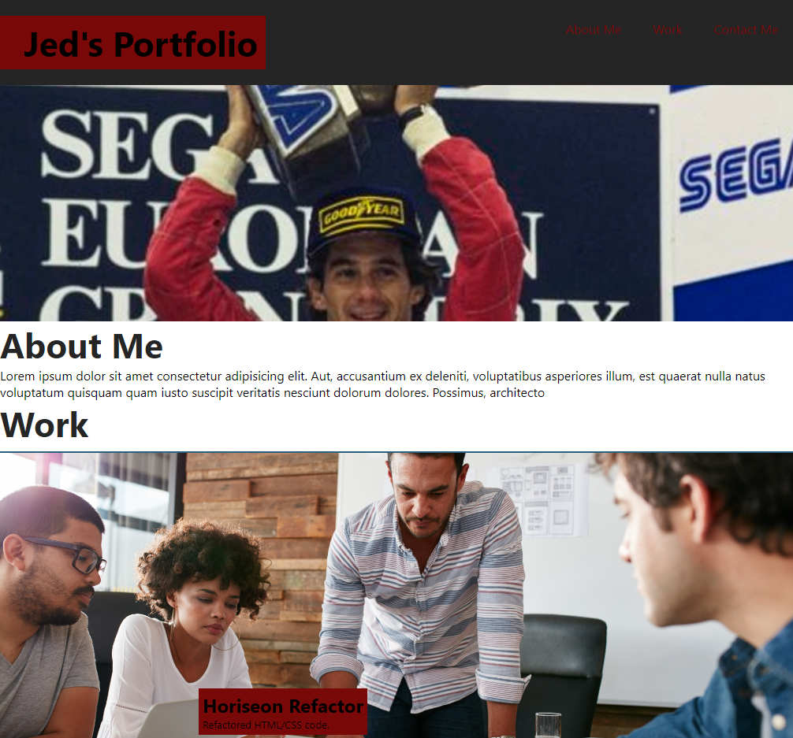

# Mock-Portfolio
## Screenshot of the Portfolio Webpage

## URLs
* [Github Repository](https://github.com/SoloSolaire/Mock-Portfolio)
* [Deployed Page](https://solosolaire.github.io/Mock-Portfolio/)

## Description
As this is a even numbered week, I was tasked with creating a portfolio from scratch. I adhered to the acceptance criteria by presenting my contact info, recent work and a way to navigate along the page. I also made sure that the portfolio is a responsive layout that adapts to the viewers viewport. The styling of the page was influenced by the reference provided within the Module 2 README.